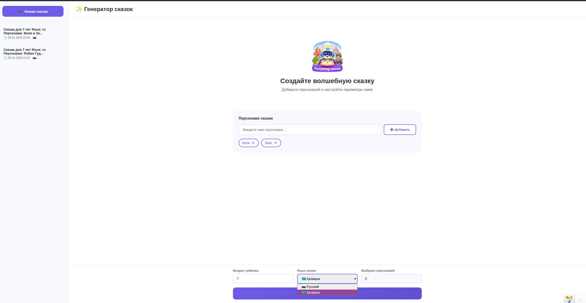
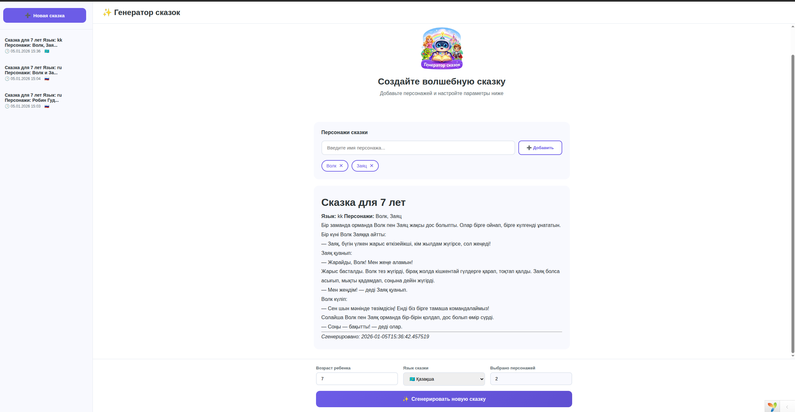
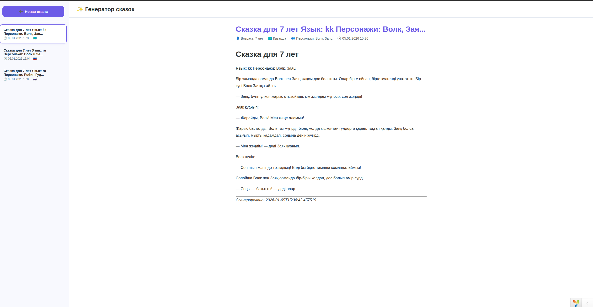

# Story Generator Platform

Набор связанных мини‑проектов для генерации детских сказок с использованием AI.

Проект состоит из нескольких независимых сервисов (frontend, backend, AI‑API), которые могут запускаться локально и взаимодействуют между собой по HTTP.

---

## 🧩 Состав проекта

### 1️⃣ Yii2 Backend (Web + API)

Основное веб‑приложение:

- UI для ввода параметров сказки
- Streaming генерация текста (SSE)
- Интеграция с Python AI‑сервисом
- Работа с базой данных

📄 Документация:

- [README — Yii2 Backend](./src/web/README.md)

---

### 2️⃣ Python AI Service (FastAPI)

Сервис генерации сказок:

- FastAPI + Uvicorn
- Интеграция с OpenAI API
- Streaming ответов
- Конфигурация через `.env`

📄 Документация:

- [README — Python AI Service](./src/story-generate-api/README.md)

---

### 3️⃣ Общая архитектура

```
[ Browser ]
     ↓
[ Yii2 Backend ]  ──▶  [ MySQL ]
     ↓
[ Python AI Service ]  ──▶  [ OpenAI API ]
```

---

## 🖼 Скриншоты приложения

Ниже представлены реальные скриншоты интерфейса приложения:

<p align="center">
  
  
  
</p>

---

## 🚀 Быстрый старт

1. Запустить **Python AI Service**
2. Настроить `.env` и БД для **Yii2 Backend**
3. Запустить Yii2 приложение
4. Открыть веб‑интерфейс и сгенерировать сказку

Подробные шаги описаны в README каждого сервиса.

---

## 📌 Примечания

- Все чувствительные данные хранятся в `.env`
- Проекты можно запускать независимо
- Docker пока не используется (локальный dev‑режим)
